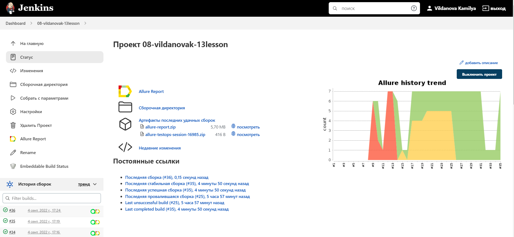
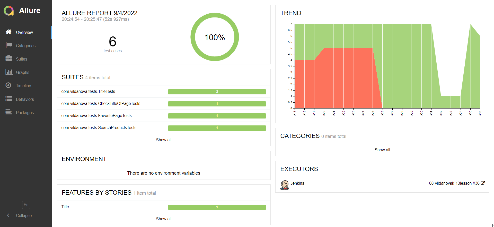
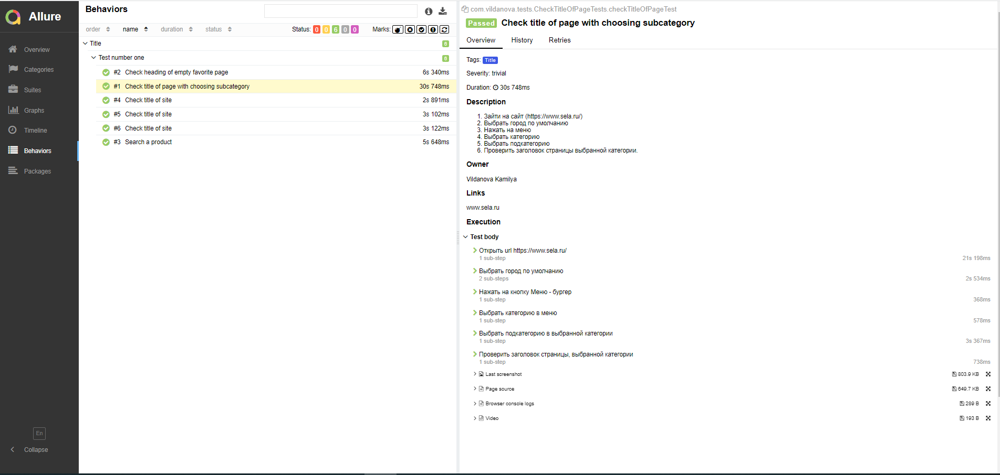
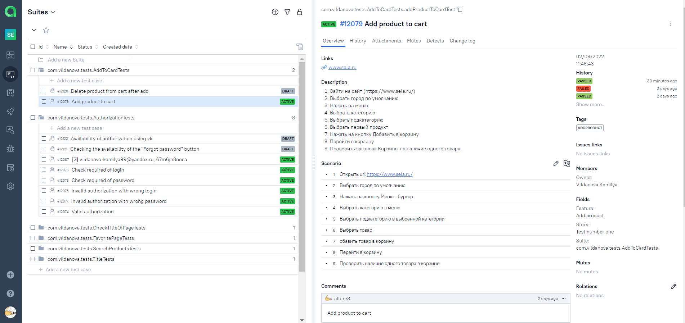
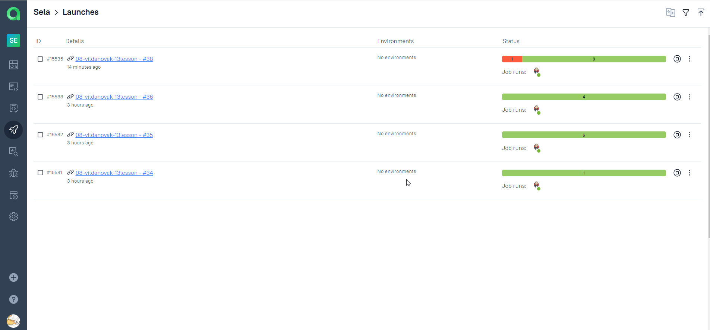
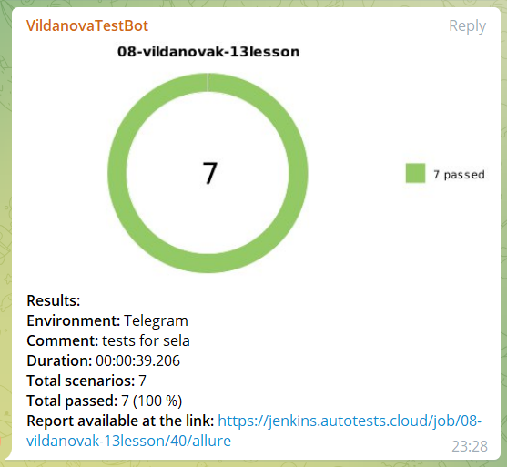
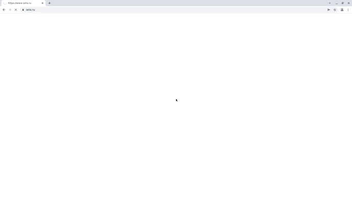

# Автотесты для [sela.ru](https://www.sela.ru/)

___

## Стек используемых технологий:

| GitHub | IDEA | Java | Junit5 | Gradle | Selenide |
|:------:|:----:|:----:|:------:|:------:|:--------:|
|  |  |  |  |  |  |

| Selenoid | Allure Report | Allure TO | Jenkins | Telegram | Jira |
|:--------:|:-------------:|:---------:|:-------:|:----:|:----:|
|  |  |  |  |  |   |

___

## Команды запуска тестов из терминала:

- Запуск тестов на проверку авторизации: 
  clean task authorization_tests -Dbrowser=${BROWSER} -Dversion=${VERSION}
  -Dsize=${SIZE}
- Запуск тестов на проверку на добавление товара в корзину: 
  clean task add_product_tests -Dbrowser=${BROWSER}
  -Dversion=${VERSION} -Dsize=${SIZE}
- Запуск тестов на проверку заголовков: 
   clean task check_titles_tests -Dbrowser=${BROWSER} -Dversion=${VERSION}
  -Dsize=${SIZE}

## Примеры используемых технологий:

### :newspaper: В качестве CI системы использован Jenkins

### :newspaper: Построение отчета в Allure Reports по результатам прогона

### :newspaper: Для удобства представлена вся информация о тесте, которая была указана в аннотациях

### :newspaper: В качестве дополнительного отчета использован Allure TestOps

### :newspaper: История запусков тестов в Allure TestOps

### :newspaper: Настроена интеграция с Jira

### :newspaper: По результату выполнения тестов отправляется уведомление в телеграм

### :newspaper: Видео прохождения теста - добавление товара в корзину

